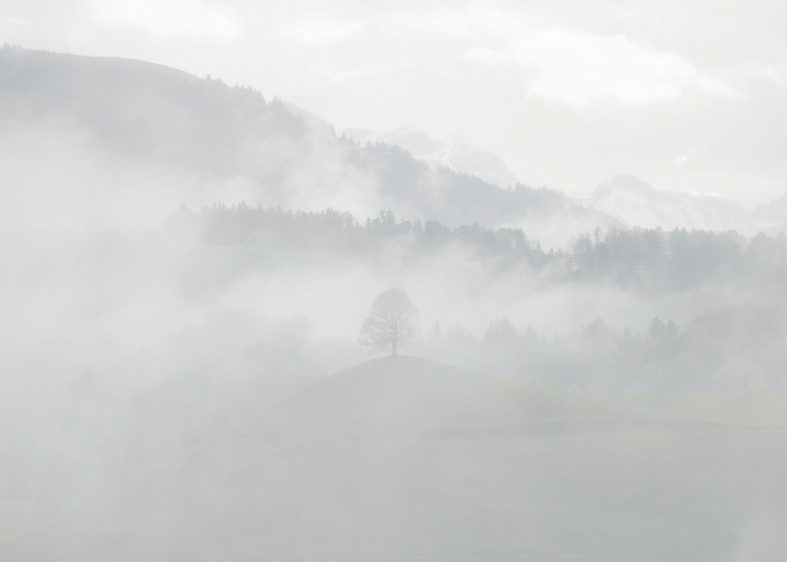
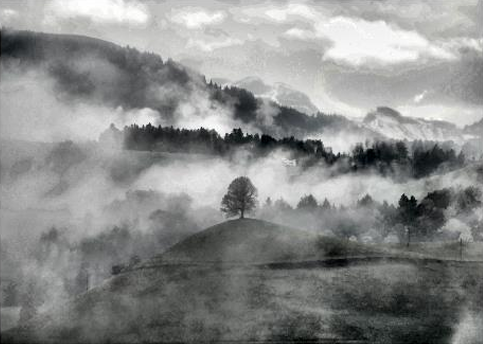

# Visual_Clarity_Restoration_System

## Overview
MATLAB-based mist removal using:
- CLAHE
- Gamma Correction
- Morphological Filtering
- Gaussian Filtering
- Unsharp Masking

## Input

## Output

## Run
Open `mist_removal.m` in MATLAB and run the script.
